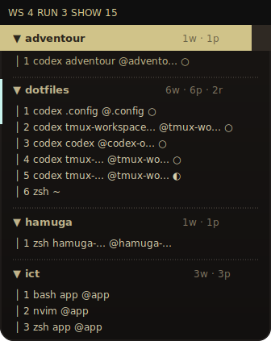

# tmux-workspace-sidebar

Persistent tmux sidebar for multi-workspace and multi-agent workflows.

It renders a long-lived sidebar pane instead of rebuilding a popup on every action. The sidebar shows a tree of:

- sessions
- windows
- panes

It is designed for setups where one tmux server contains multiple projects and multiple agent or tool panes such as Codex, Flutter, and plain shells. Non-integrated panes still appear in the tree; status integrations are currently provider-backed for Codex and Flutter.



## Features

- Persistent sidebar pane, not a chooser popup
- Global mode: when enabled, the sidebar appears in every tmux window across sessions
- Hides the tmux status bar while one or more sidebar panes exist and restores it when the last sidebar is gone
- Tree view for `session -> window -> pane`
- Fast active-row refresh on window or pane switches
- Auto-sync for new windows and sessions
- Auto-cleanup when the last non-sidebar pane in a window is killed
- Session, window, and pane actions from the sidebar
- Optional Codex launch action from the selected row
- Optional app status badges via integrations
- Optional push notifications for actionable app updates

## Requirements

- `tmux` 3.6a tested
- `bash`
- `python3`
- Optional: `tv` for the actionable inbox picker popup
- Optional: `curl` for the built-in `ntfy` push transport

## Installation

### Manual

Clone the repository anywhere you keep tmux plugins:

```bash
git clone https://github.com/themuuln/tmux-workspace-sidebar ~/.tmux/plugins/tmux-workspace-sidebar
```

Add this to `.tmux.conf`:

```tmux
run-shell '~/.tmux/plugins/tmux-workspace-sidebar/sidebar.tmux'
```

Reload tmux:

```bash
tmux source-file ~/.tmux.conf
```

### TPM

Add this to `.tmux.conf`:

```tmux
set -g @plugin 'themuuln/tmux-workspace-sidebar'
run '~/.tmux/plugins/tpm/tpm'
```

Then install with `prefix + I`.

The plugin resolves its own install path at load time and stores it in the tmux option `@workspace_sidebar_plugin_dir`. That keeps helper integrations portable even if the clone path differs between machines.

## Default Keys

- `prefix + B`: toggle sidebar globally on or off
- `prefix + b`: focus the sidebar in the current window
- `prefix + m`: jump to the oldest actionable pane
- `prefix + M`: jump to the next actionable pane
- `prefix + u`: open the actionable inbox picker

Inside the sidebar:

- `Enter`: switch to the selected session, window, or pane
- `h` / `Left`: collapse
- `l` / `Right` / `Space`: expand or activate
- `j` / `k`: move selection
- `g` / `G`: jump to top or bottom
- `n`: create session
- `r`: rename session, window, or pane title
- `x`: kill session, window, or pane
- `C`: open a Codex window in the selected row's path
- `q`: close the sidebar pane in the current window

## Options

Set these before `run-shell`:

```tmux
set -g @workspace_sidebar_width '32'
set -g @workspace_sidebar_position 'left'
set -g @workspace_sidebar_toggle_key 'B'
set -g @workspace_sidebar_focus_key 'b'
set -g @workspace_sidebar_inbox_key 'm'
set -g @workspace_sidebar_inbox_next_key 'M'
set -g @workspace_sidebar_inbox_picker_key 'u'
set -g @workspace_sidebar_inbox_picker_theme ''
set -g @workspace_sidebar_inbox_picker_selection_bg '#264f78'
set -g @workspace_sidebar_inbox_picker_selection_fg '#ffffff'
set -g @workspace_sidebar_python 'python3'
set -g @workspace_sidebar_codex_command 'codex'
set -g @workspace_sidebar_codex_window_name 'codex'
set -g @workspace_sidebar_push_enabled '0'
set -g @workspace_sidebar_push_statuses 'needs-input,error,done'
set -g @workspace_sidebar_push_ntfy_topic ''
```

See [docs/options.md](docs/options.md) for details.

If the actionable inbox picker selection is hard to read with your `tv` theme, override it in tmux:

```tmux
set -g @workspace_sidebar_inbox_picker_selection_bg '#3b4252'
set -g @workspace_sidebar_inbox_picker_selection_fg '#eceff4'
```

## Status Integrations

The sidebar can show per-pane state badges:

- `○` ready or seen done
- `◐` running
- `?` needs input
- `✓` new done notification
- `✕` error

The sidebar state model is shared across providers and uses the same badge set for each supported app:

- Codex via [scripts/hook-codex.sh](scripts/hook-codex.sh)
- Flutter via [scripts/flutter-with-status.sh](scripts/flutter-with-status.sh)

The Codex hook parser lives in [scripts/hook-codex.sh](scripts/hook-codex.sh) and writes per-pane state files that the sidebar reads.

Example `~/.codex/config.toml` hook using the default TPM/manual install path:

```toml
notify = ["bash", "-lc", "~/.tmux/plugins/tmux-workspace-sidebar/scripts/hook-codex.sh"]

[hooks]
session_start = [
  { hooks = [{ type = "command", command = "bash ~/.tmux/plugins/tmux-workspace-sidebar/scripts/hook-codex.sh SessionStart" }] }
]
user_prompt_submit = [
  { hooks = [{ type = "command", command = "bash ~/.tmux/plugins/tmux-workspace-sidebar/scripts/hook-codex.sh UserPromptSubmit" }] }
]
stopped = [
  { hooks = [{ type = "command", command = "bash ~/.tmux/plugins/tmux-workspace-sidebar/scripts/hook-codex.sh stopped" }] }
]
blocked = [
  { hooks = [{ type = "command", command = "bash ~/.tmux/plugins/tmux-workspace-sidebar/scripts/hook-codex.sh blocked" }] }
]

[tui]
notifications = ["agent-turn-start", "agent-turn-complete", "approval-requested"]
```

If you install the plugin somewhere else, replace `~/.tmux/plugins/tmux-workspace-sidebar` with your clone path, or resolve it from tmux at runtime with:

```bash
tmux show-option -gqv @workspace_sidebar_plugin_dir
```

Portable hook example that resolves the path from tmux at runtime:

```toml
notify = [
  "bash",
  "-lc",
  'exec "$(tmux show-option -gqv @workspace_sidebar_plugin_dir)/scripts/hook-codex.sh"'
]

[hooks]
session_start = [
  { hooks = [{ type = "command", command = 'bash -lc '\''exec "$(tmux show-option -gqv @workspace_sidebar_plugin_dir)/scripts/hook-codex.sh" SessionStart'\''' }] }
]
user_prompt_submit = [
  { hooks = [{ type = "command", command = 'bash -lc '\''exec "$(tmux show-option -gqv @workspace_sidebar_plugin_dir)/scripts/hook-codex.sh" UserPromptSubmit'\''' }] }
]
stopped = [
  { hooks = [{ type = "command", command = 'bash -lc '\''exec "$(tmux show-option -gqv @workspace_sidebar_plugin_dir)/scripts/hook-codex.sh" stopped'\''' }] }
]
blocked = [
  { hooks = [{ type = "command", command = 'bash -lc '\''exec "$(tmux show-option -gqv @workspace_sidebar_plugin_dir)/scripts/hook-codex.sh" blocked'\''' }] }
]
```

On current Codex builds, the hook keys are lowercase (`session_start`, `user_prompt_submit`, `stopped`, `blocked`). Older PascalCase examples do not fire reliably. The `notify` command alone is not enough to keep the running badge accurate on current Codex builds. The command hooks above provide reliable `idle`, `running`, and `done` transitions, while `notify` still carries completion and approval metadata when available.

The plugin also exposes an actionable inbox flow:

- `prefix + m` jumps to the oldest actionable pane
- `prefix + M` jumps to the next actionable pane
- `prefix + u` opens a `tv` picker for the actionable inbox

Actionable panes are provider-backed panes with `needs-input`, `error`, or unread `done` status. Jumping to one clears that notification immediately so the next jump moves forward through the inbox. A completed pane stays `done`, but once seen its badge changes from `✓` to `○` and it drops out of the inbox.

This integration is optional. The core sidebar works without it.

### Flutter

For Flutter commands, run them through the wrapper so the sidebar can track `running`, `idle`, `done`, and `error` transitions:

```bash
~/.tmux/plugins/tmux-workspace-sidebar/scripts/flutter-with-status.sh run -d macos
~/.tmux/plugins/tmux-workspace-sidebar/scripts/flutter-with-status.sh test
~/.tmux/plugins/tmux-workspace-sidebar/scripts/flutter-with-status.sh analyze
```

The wrapper marks the pane as running immediately, streams command output unchanged, upgrades common `flutter run` readiness lines to `idle`, and writes `done` or `error` on exit.

## Push Notifications

The sidebar can optionally send a push notification when a supported app pane changes into one of the configured statuses. By default that is:

- `needs-input`
- `error`
- `done`

Built-in transport uses `ntfy` over `curl`:

```tmux
set -g @workspace_sidebar_push_enabled '1'
set -g @workspace_sidebar_push_ntfy_topic 'my-codex-inbox'
```

Optional authenticated topic:

```tmux
set -g @workspace_sidebar_push_ntfy_token 'YOUR_TOKEN'
```

If you already have your own notifier, set a custom command instead:

```tmux
set -g @workspace_sidebar_push_enabled '1'
set -g @workspace_sidebar_push_command 'bash ~/.local/bin/send-codex-push'
```

Custom commands receive the notification details through environment variables such as `WORKSPACE_SIDEBAR_PUSH_APP`, `WORKSPACE_SIDEBAR_PUSH_TITLE`, `WORKSPACE_SIDEBAR_PUSH_BODY`, `WORKSPACE_SIDEBAR_PUSH_STATUS`, and `WORKSPACE_SIDEBAR_PUSH_PANE_CURRENT_PATH`.

## Architecture

The code is split by responsibility:

- `scripts/lifecycle.sh`: owns the global sidebar lifecycle invariant, including enable, disable, focus, and reconcile.
- `tmux_workspace_sidebar/apps.py`: declares provider-specific status behavior such as stale-state cleanup, actionable ordering, and notification labels.
- `tmux_workspace_sidebar/codex.py`: normalizes Codex hook payloads into sidebar status updates.
- `tmux_workspace_sidebar/flutter.py`: normalizes Flutter log lines into sidebar status updates for the wrapper script.
- `tmux_workspace_sidebar/state.py`: owns pane-state storage, selection persistence, and actionable inbox ordering.
- `tmux_workspace_sidebar/tmux.py`: wraps Python-side tmux command and query execution.
- `tmux_workspace_sidebar/sidebar_tree.py`: builds the sidebar tree and filtered row projection from tmux snapshots plus pane state.
- `tmux_workspace_sidebar/sidebar_input.py`: owns key dispatch and inline input-mode state transitions.
- `tmux_workspace_sidebar/sidebar_render.py`: handles curses rendering and footer/status presentation.
- `bin/tmux-workspace-sidebar`: the curses controller that wires the tmux client, snapshot loading, input handling, and rendering together.

## Behavior Notes

- The sidebar pane itself is hidden from the tree.
- Visible panes are renumbered in display order after the sidebar is filtered out.
- When global mode is enabled, new tmux windows inherit the sidebar automatically.
- Switching windows or sessions normalizes focus back to the target window's non-sidebar pane, so the sidebar behaves like one shared navigator instead of stealing per-window focus.
- The tmux status bar is hidden while one or more sidebar panes are visible and restored to its previous value when the last sidebar pane is gone.
- If a window loses its last non-sidebar pane, the sidebar is removed too so you do not get stuck in a sidebar-only window.

## Smoke Test

Run:

```bash
./scripts/smoke-test.sh
./scripts/test-hook-codex.sh
./scripts/test-push-notify.sh
```

The smoke test validates sidebar lifecycle behavior in an isolated tmux server. The hook test validates Codex event parsing and state-file updates. The push-notify test validates the built-in `ntfy` transport argument construction with a mocked `curl`.

## License

[MIT](LICENSE.md)
